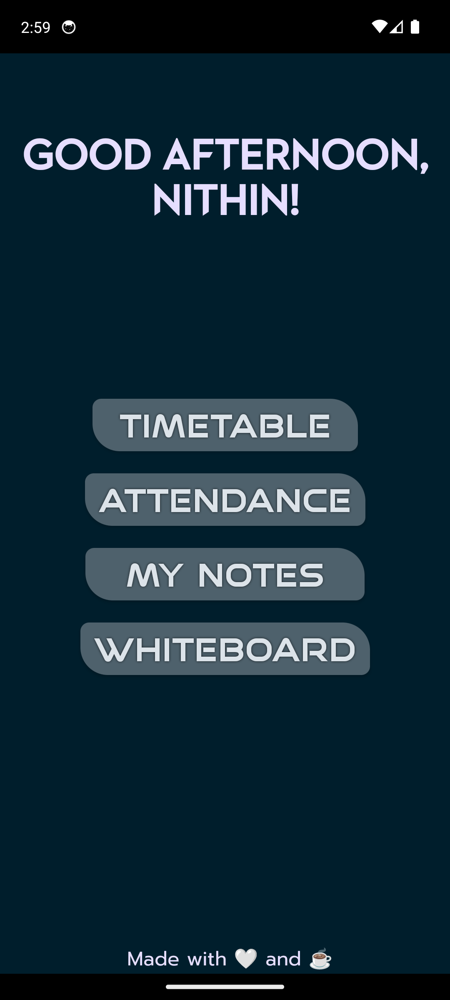
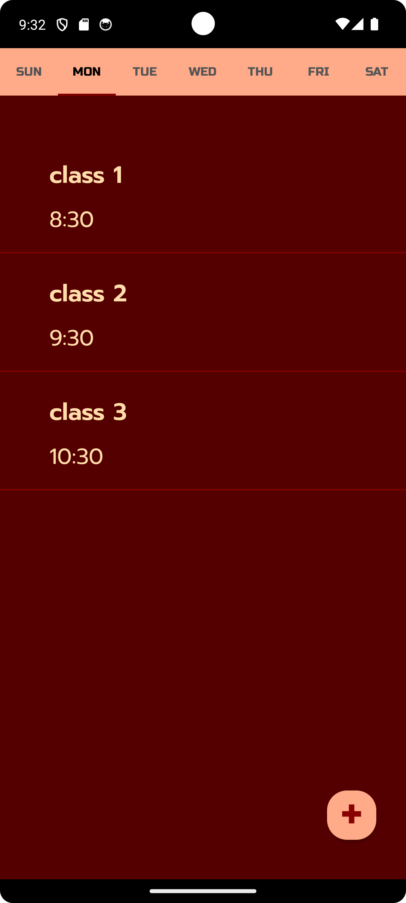
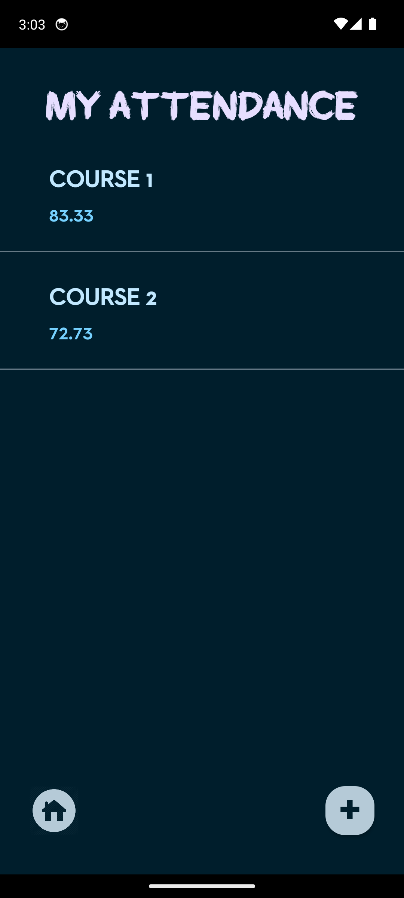
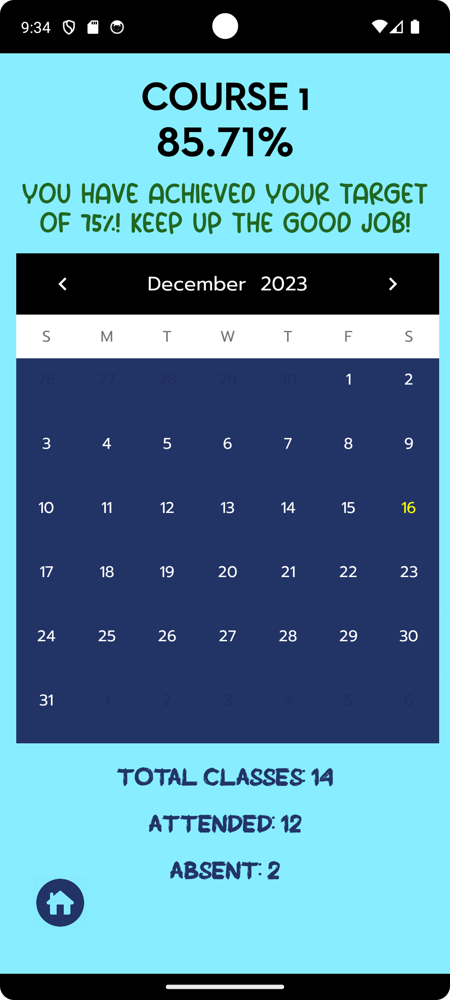
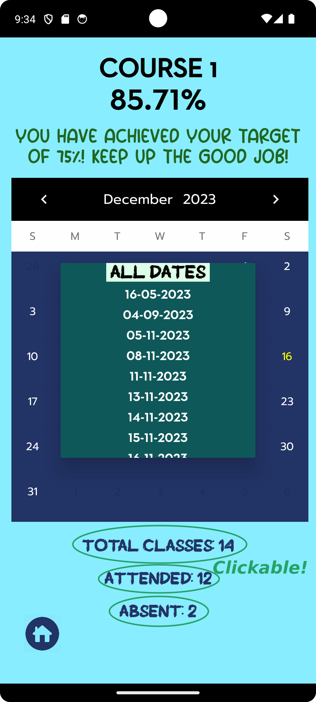
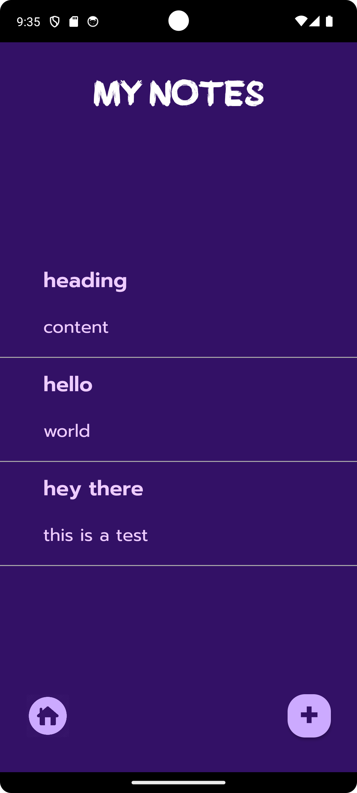
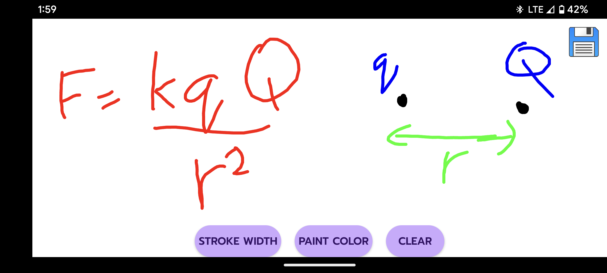

# AcademEase App

## Overview
The AcademEase App is a versatile Android application designed to help students manage their daily schedules, attendance, notes, and stay organized with a virtual whiteboard. It also provides a handy widget to display upcoming classes, ensuring students never miss an important session.

## Features
- **Timetable Creation:** Create and manage daily timetables to keep track of your classes and other activities.
- **Attendance Tracker:** Easily mark and monitor your attendance for each course, and view the dates you were present and absent.
- **Note-taking:** Jot down important information and save it for later reference.
- **Virtual Whiteboard:** Utilize a digital whiteboard for brainstorming, diagrams, and sketching.
- **Upcoming Class Widget:** A widget on your home screen displays your upcoming class schedule at a glance.

## Screenshots

## Installation
[Download the apk file](https://github.com/killerninjacat/StudentCompanion/releases/download/v1.0.1/student_companion.apk) and install it on your Android device.
Or alternatively, if you want to build from source,
1. Clone this repository.
2. Open the project in Android Studio.
3. Build and run the app on your Android device or emulator.

## Usage
1. Launch the app and create your timetable for each day.
2. Add courses, set your target attendance for each course and mark your attendance.
3. View your attendance statistics and the dates you were present and absent by clicking the labels below the calendar.
4. Use the note-taking feature to jot down important information.
5. Access the virtual whiteboard for creative work.
6. Add the upcoming class widget to your home screen for quick reference.
7. Tip: The timetable list and attendance list are long-clickable. Long-click on an item to edit or delete it.

## Contact
If you have any questions or suggestions, please contact me at [nithin27balan@gmail.com](mailto:nithin27balan@gmail.com).

---
