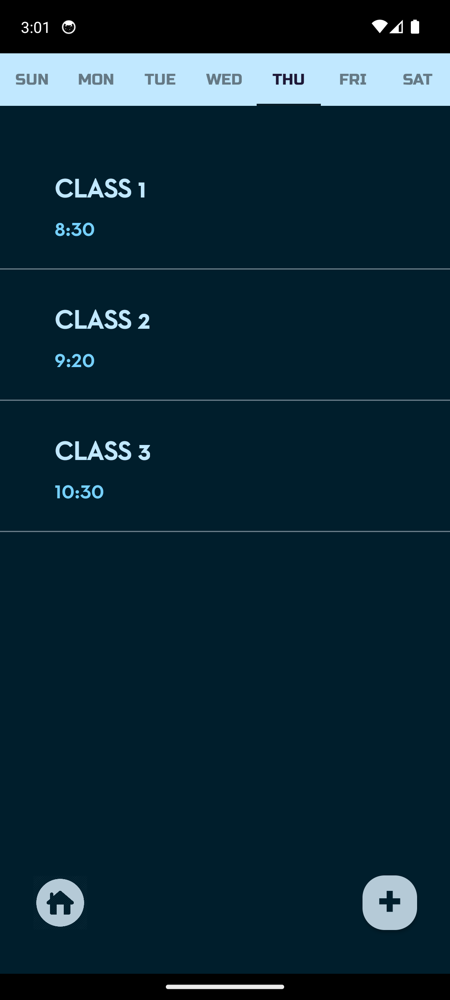
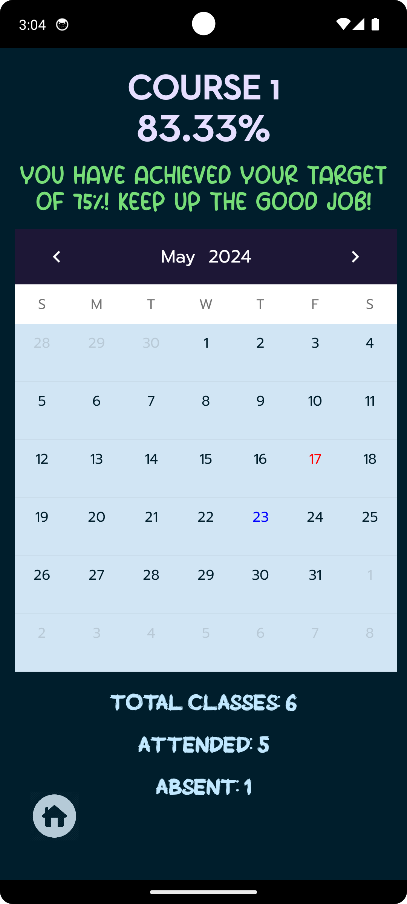
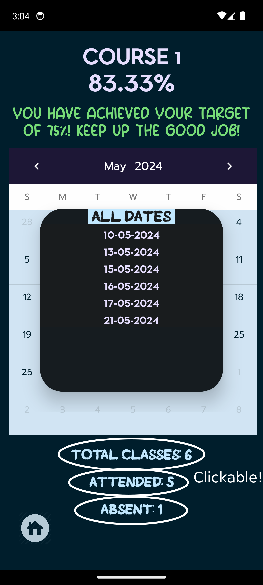
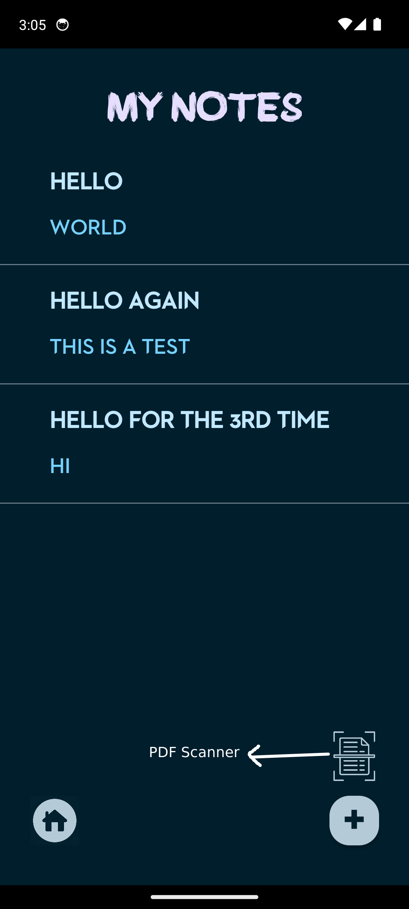

# Student Companion App

## Overview
The Student Companion App is a versatile Android application designed to help students manage their daily schedules, attendance, notes, and stay organized with a virtual whiteboard. It also provides a handy widget to display upcoming classes, ensuring students never miss an important session.

## Features
- **Timetable Creation:** Create and manage daily timetables to keep track of your classes and other activities.
- **Attendance Tracker:** Easily mark and monitor your attendance for each course, and view the dates you were present and absent.
- **Note-taking:** Take notes during classes, and keep all your study materials organized within the app.
- **Virtual Whiteboard:** Utilize a digital whiteboard for brainstorming, diagrams, and sketching.
- **Upcoming Class Widget:** A widget on your home screen displays your upcoming class schedule at a glance.

## Screenshots

## Installation
[Download the apk file](https://github.com/killerninjacat/StudentCompanion/releases/download/v1.0.1/student_companion.apk) and install it on your Android device.
Or alternatively, if you want to build from source,
1. Clone this repository.
2. Open the project in Android Studio.
3. Build and run the app on your Android device or emulator.

## Usage
1. Launch the app and create your timetable.
2. Add courses and mark your attendance.
3. Use the note-taking feature to jot down important information.
4. Access the virtual whiteboard for creative work.
5. Add the upcoming class widget to your home screen for quick reference.

## Contact
If you have any questions or suggestions, please contact me at [nithin27balan@gmail.com](mailto:nithin27balan@gmail.com).

---
